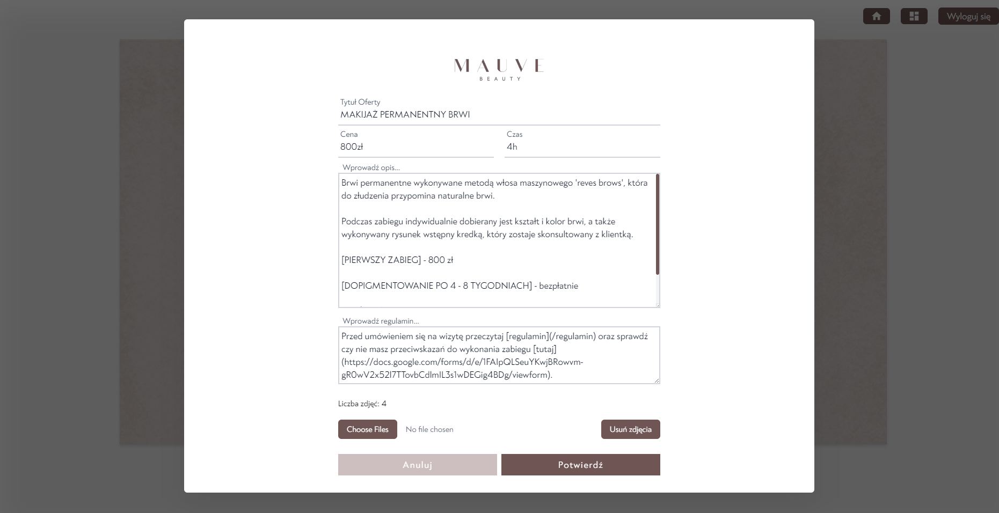

<div align="center">

# Mauve Project

[Live Page][live-page] . [Fallback Page][fallback-page]

</div>

<details>
<summary>Table of contents</summary>

-   [Overview](#overview)
    -   [Description](#the-challenge)
    -   [Screenshots - Landing Page](#screenshots-landing)
    -   [Screenshots - Offer](#screenshots-offer)
    -   [Screenshots - Admin Panel](#screenshots-admin-panel)
    -   [Screenshots - Admin Offers](#screenshots-admin-offers)
    -   [Screenshots - Admin Edit Offer](#screenshots-admin-edit)
    -   [Links](#links)
-   [My process](#my-process)
    -   [Built with](#built-with)
    -   [Getting Started](#getting-started)
-   [Author](#author)

</details>

## Overview

### Description

Mauve is a project created for a company from the Beauty industry.

In addition to presenting the company's offer in a stylish and simple design, the application also has an administrator panel in which the manager can freely edit the displayed content in cooperation with supabase.

### Screenshots - Landing Page

<table>
    <tr>
        <td>
            
        </td>
        <td>
            
        </td>
    </tr>
</table>

### Screenshots - Offer Slide

<table>
    <tr>
        <td>
            
        </td>
        <td>
            
        </td>
    </tr>
</table>

### Screenshots - Admin Panel

<table>
    <tr>
        <td>
            
        </td>
        <td>
            
        </td>
    </tr>
</table>

### Screenshots - Admin Offers

<table>
    <tr>
        <td>
            
        </td>
        <td>
            
        </td>
    </tr>
</table>

### Screenshots - Admin Edit Offer

<table>
    <tr>
        <td>
            
        </td>
        <td>
            
        </td>
    </tr>
</table>

### Links

-   [Live Page][live-page]
-   [Fallaback Page][fallback-page]

## My Process

### Built with

-   Next.js
-   TailwindCSS
-   Supabase
-   Framer Motion

### Getting Started

First, run the development server:

```bash
npm run dev
# or
yarn dev
# or
pnpm dev
```

Open [http://localhost:3000](http://localhost:3000) with your browser to see the result.

You can start editing the page by modifying `app/page.js`. The page auto-updates as you edit the file.

This project uses [`next/font`](https://nextjs.org/docs/basic-features/font-optimization) to automatically optimize and load Inter, a custom Google Font.

## Author

-   Jczyszczon - [link](https://jczyszczon.pl)

<p align="right">(<a href="#top">back to top</a>)</p>

[live-page]: https://www.mauve.pl
[fallback-page]: https://mauve-brown.vercel.app


